<div align="center">


# SteamEdge

**Collect Steam trading cards, bank playtime and manage achievements without ever opening the Steam client.**

[](./LICENSE)
[](https://github.com/Miabeyefendi/SteamEdge/releases/latest)
[](#-installation)
[](#)
[](https://github.com/Miabeyefendi)

**English** · [Türkçe](./docs/locales/README_TR.md) · [Español](./docs/locales/README_ES.md) · [简体中文](./docs/locales/README_ZH.md) · [Русский](./docs/locales/README_RU.md)

[Install](#-installation) · [Features](#-highlights) · [Usage](#-quick-start) · [Tutorial](./docs/guides/TUTORIAL.md) · [Changelog](./CHANGELOG.md)

<a href="https://github.com/Miabeyefendi/SteamEdge/releases/latest">
  
</a>
<a href="./docs/guides/TUTORIAL.md">
  <picture>
    <source media="(prefers-color-scheme: dark)" srcset="./assets/btn-tutorial-dark.svg">
    
  </picture>
</a>

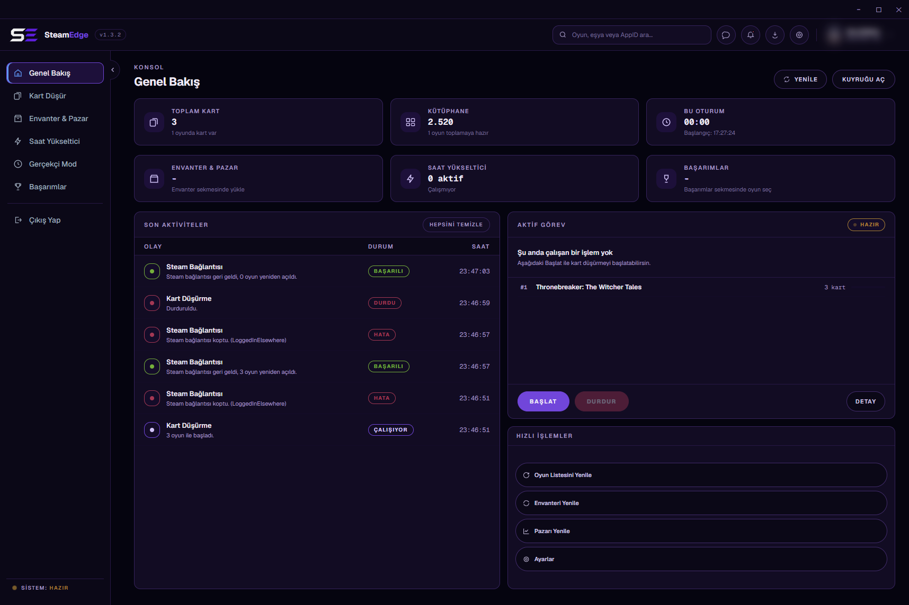

</div>

---

## ✨ Highlights

- **Card farming** - Runs your games as "playing" so trading cards drop. Seven modes, one of which knows that on accounts with restricted drops Steam only starts dropping after a game passes a playtime threshold, usually two hours.
- **Hours booster** - Keeps up to 32 games open at once, with optional playtime syncing that pulls a selection up to the same total.
- **Achievement manager** - Reads the real locked and unlocked state straight from Steam's protocol, then unlocks or relocks in bulk.
- **Realistic Mode** - Holds one game open and unlocks its achievements from the most common to the rarest, spread across the session, so the profile reads like it was actually played.
- **Inventory and market** - Real sale history, order book, bulk average prices and selling, all in your wallet's own currency. Listing prices use Steam's own fee calculation, and bulk selling stops and tells you when Steam's per-account limit is reached, or splits the sale into batches. Active listings can be taken back, and booster packs opened, from the same page.
- **Product keys** - Paste a list of keys and they are redeemed in the background, one at a time. When Steam's hourly limit is reached the queue waits and carries on by itself.
- **Chat** - Friend list, conversations and sending, over the same network protocol. Unread counts show on the tab, so nothing is missed while a queue runs.
- **Multiple accounts** - Several accounts connected at once, each farming in the background, switchable without losing progress. Statistics are kept per account.
- **Schedule, proxy and token protection** - Card farming can run by itself inside a time range, each account can use its own HTTP or SOCKS5 proxy, and saved sign-in tokens can be encrypted with Windows DPAPI.
- **Themes and languages** - Dark, Midnight Purple and White themes, login screen included. Turkish, English, German, Spanish, Traditional Chinese and Russian. New installs start in English.
- **No Steam client** - Talks Steam's own network protocol. The client is never launched and is not required.
- **Portable** - Extract and run. No installer, no registry, everything lives next to the executable.

---

## 📸 Screenshots

<div align="center">

| | |
|:-:|:-:|
| 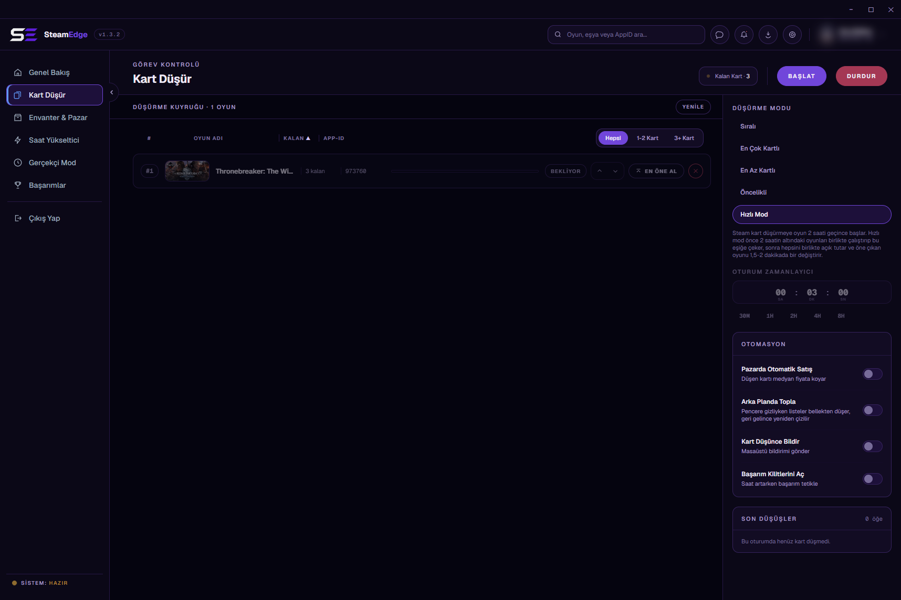<br><sub>Card Farming</sub> | 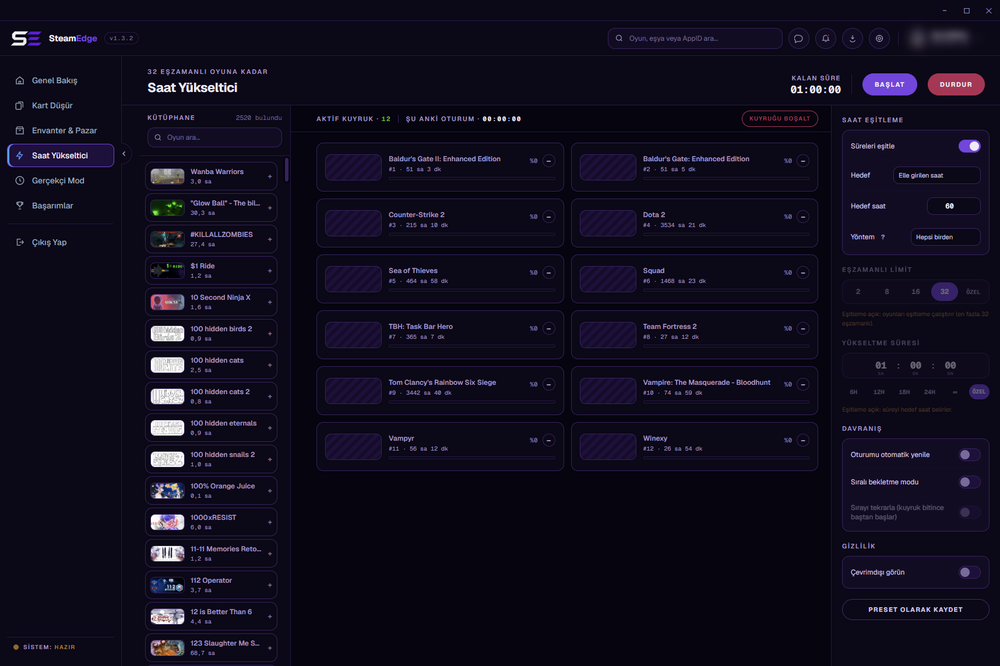<br><sub>Hour Booster</sub> |
| 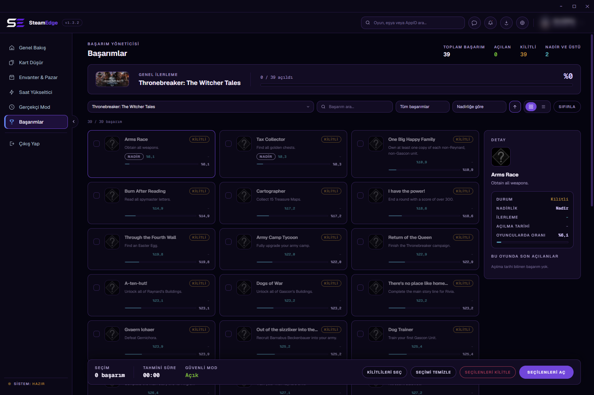<br><sub>Achievements</sub> | 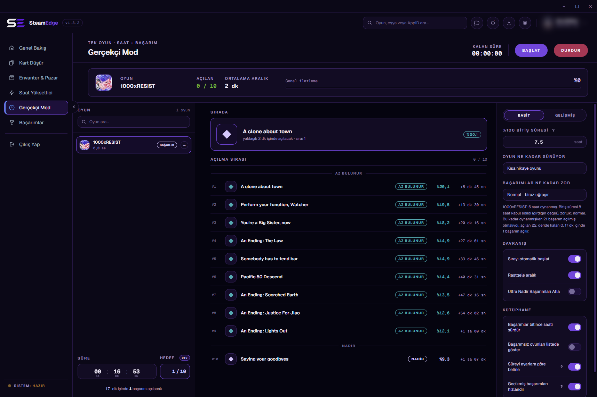<br><sub>Realistic Mode</sub> |
| 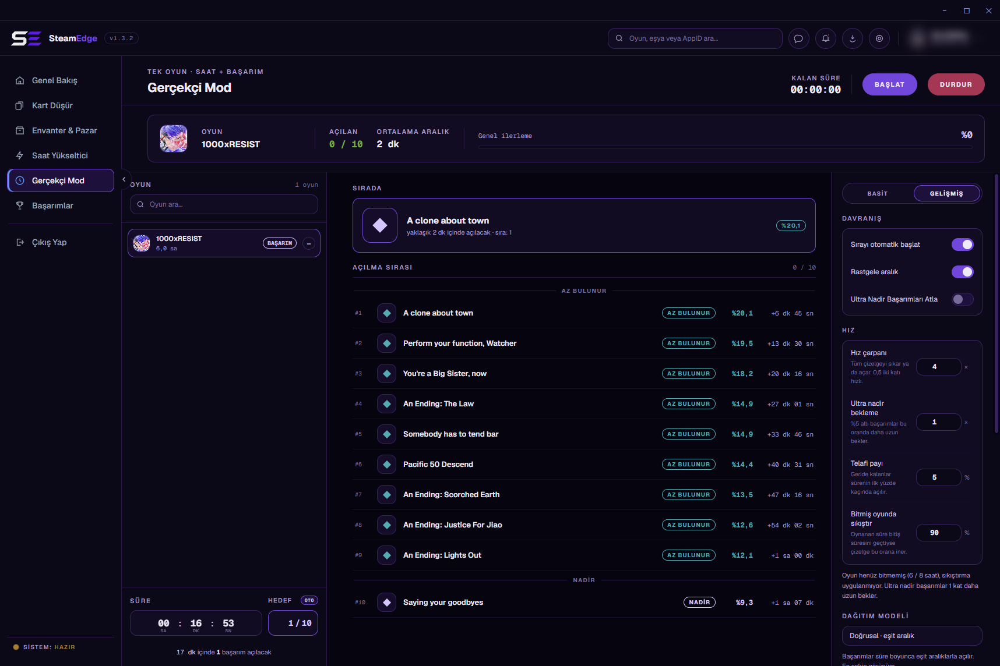<br><sub>Realistic Mode, advanced</sub> | 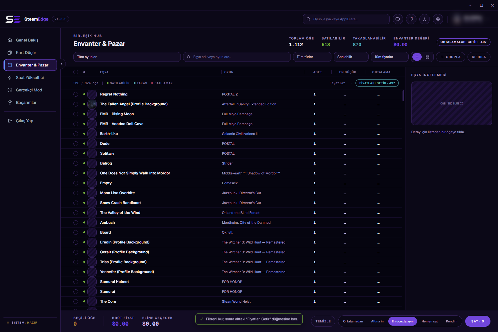<br><sub>Inventory & Market</sub> |
| 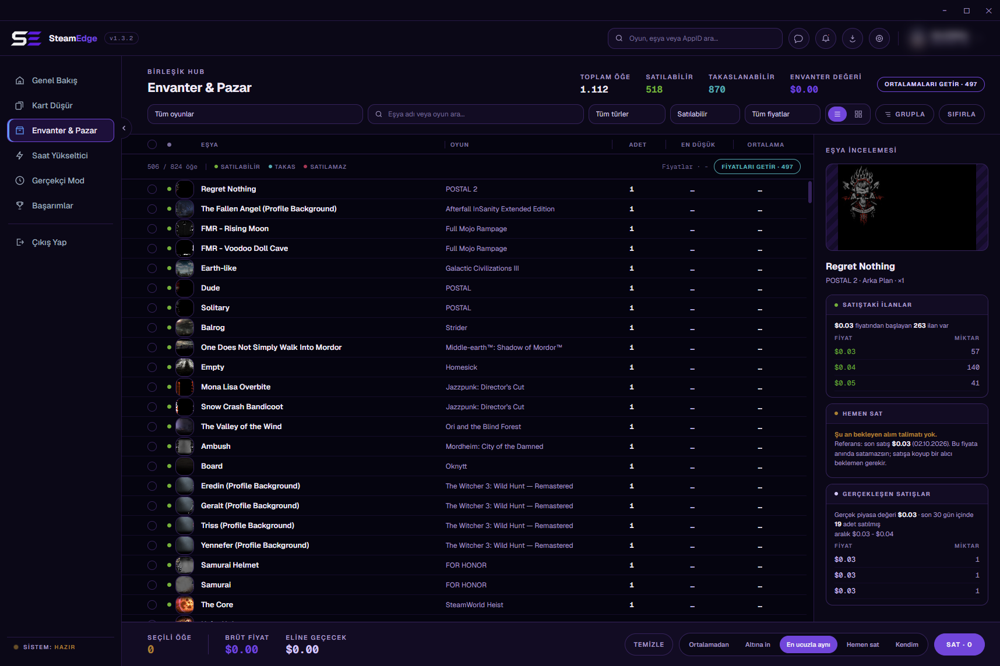<br><sub>Market, order book</sub> | 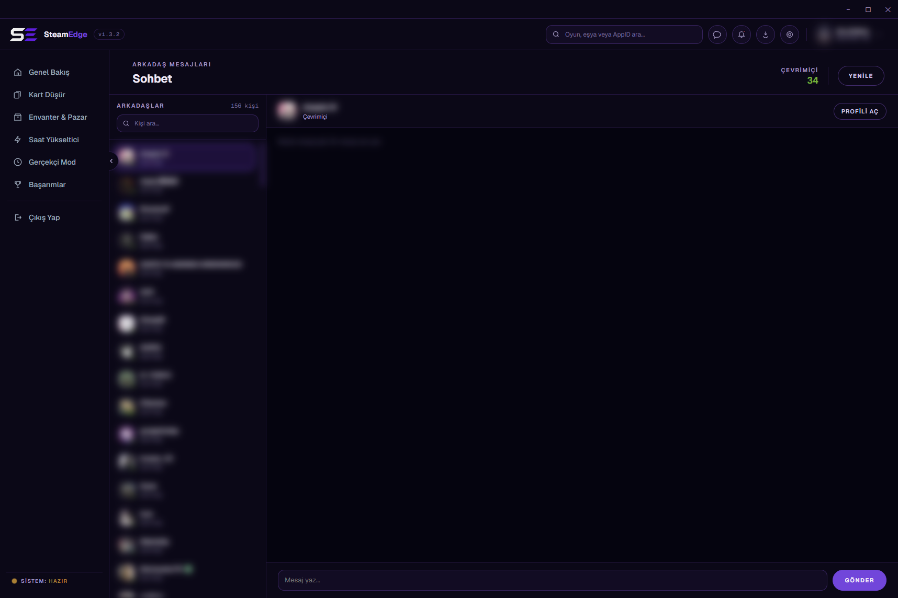<br><sub>Steam chat</sub> |
| 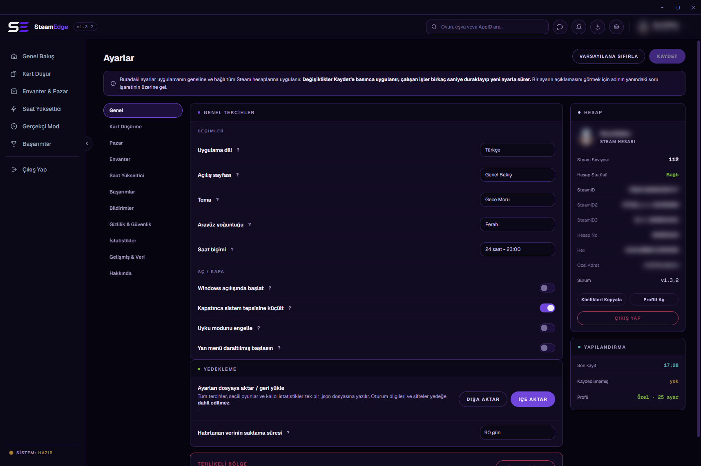<br><sub>Settings</sub> |  |

**Themes: Dark, Midnight Purple, White (Settings > General > Theme)**

| Dark | Midnight Purple | White |
|---|---|---|
| 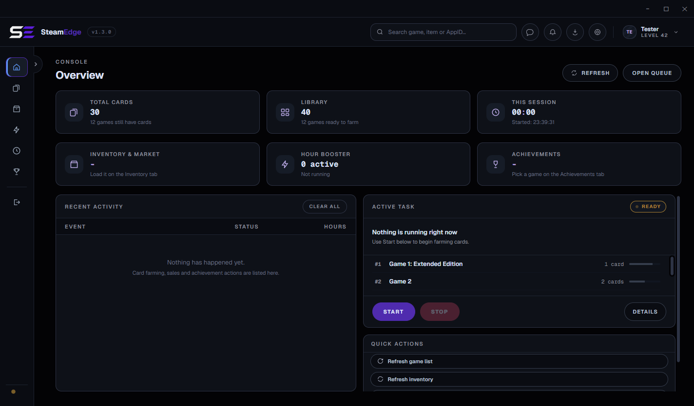 | 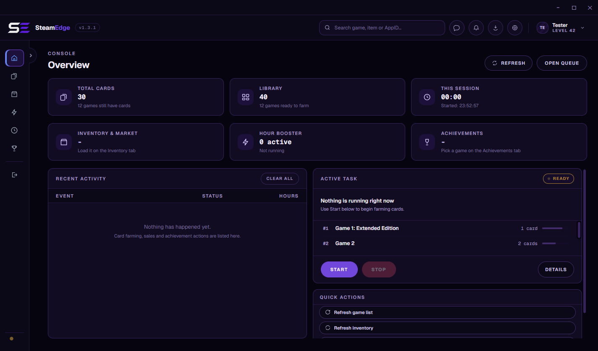 | 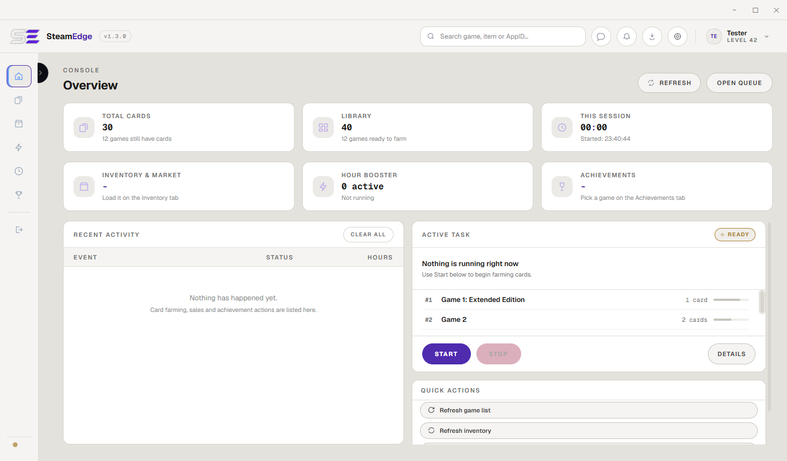 |
| 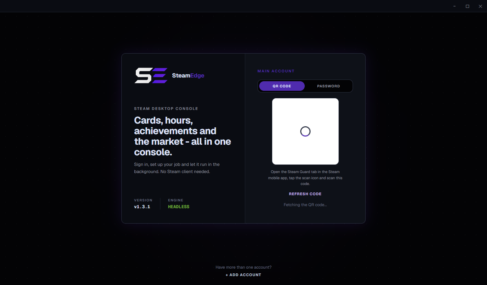 | 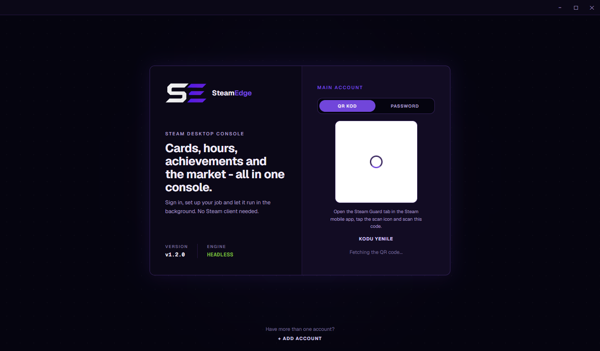 | 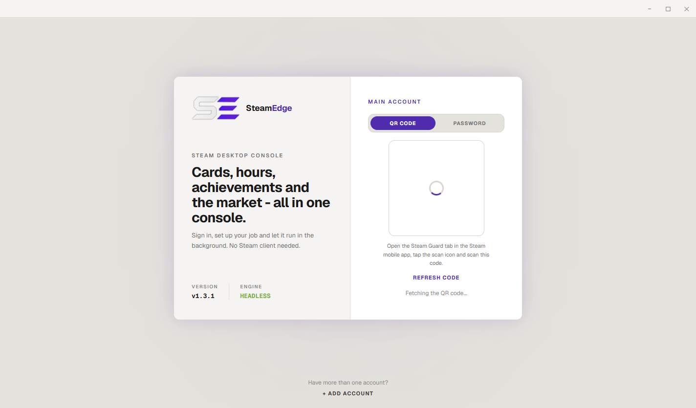 |

</div>

---

## 📦 Installation

### Requirements

| | |
|---|---|
| Operating system | Windows 10 or newer, 64 bit |
| Steam account | With Steam Guard set up, mobile or email |
| Disk space | About 330 MB extracted |
| Steam client | Not required, and not used |

### Built with


### Install

```bash
git clone https://github.com/Miabeyefendi/SteamEdge.git
cd SteamEdge
npm install
```

<details>
<summary><b>Install from a release instead</b></summary>

1. Download the latest `.rar` from the [releases page](https://github.com/Miabeyefendi/SteamEdge/releases/latest).
2. Extract it anywhere you like. A folder you own, not `Program Files`.
3. Run `SteamEdge.exe`. There is nothing to install and nothing is written outside that folder.
4. To update, extract the new version into an empty, new folder and copy the `settings/` folder from the old one into it. Extracting over the old folder while the app is open leaves a mix of two versions behind.

The `.rar` holds the portable Windows x64 build of this repository's source, produced by `npm run build` (`@electron/packager`, app code in `resources/app.asar`) and packed with WinRAR. Nothing in it is minified beyond what Electron itself ships.

SHA-256 of `SteamEdge-v1.4.3-win-x64.rar`:
`4d661abc5f52a72c519c1fa022cdc36e619c709d17ddb62208d3312bafef4c11`

Check it in PowerShell with `Get-FileHash .\SteamEdge-v1.4.3-win-x64.rar`.

</details>

---

## 🚀 Quick Start

```bash
npm start
```

On first launch you get the login screen. Scan the QR code with the Steam mobile app, or switch to the password tab and enter your credentials plus a Steam Guard code. Nothing is stored anywhere except a session token in `settings/`, next to the executable.

Once you are in, the Overview shows what is running and what is available. Open **Card Farming**, refresh the list, pick a mode and press Start. Everything else can wait until you have read the [tutorial](./docs/guides/TUTORIAL.md).

---

## ⚙️ Configuration

Settings live in `settings/settings.json` next to the executable, and per-account data in `settings/accounts/<steamID>.json`. Nearly all of it is editable from the in-app Settings page and the pages of the features themselves; there is no reason to touch the files by hand. Changes on the Settings page are applied only when you press Save, and running jobs pick them up within a few seconds.

> **Never share the `settings/` folder.** It holds your Steam session token, which is enough to use your account.

| Key | Default | What it does |
|---|---|---|
| `boostMaxGames` | `32` | How many games the hours booster keeps open at once |
| `boostSync` | `false` | Pull selected games up to the same total playtime |
| `fetchAvgWithPrice` | `true` | Fetch an item's sale average in the same pass as its price |
| `pauseFarmOnBoost` | `false` | Pause card farming while the hours booster or Realistic Mode runs |
| `bulkSellLimit` | `50` | Bulk sales are split into batches of this many items; `0` lists until Steam stops it |
| `priceDropThreshold` | `10` | Percent below Steam's 24-hour average that marks a price drop |
| `reconnectPolicy` | `unlimited` | Reconnect after a dropped connection: `unlimited`, `10`, `3` or `off` |
| `sessionTimeout` | `never` | Close all sessions after this many idle minutes; running jobs do not count as idle |
| `theme` | `dark` | Colour theme: `dark`, `midnight`, `white` |
| `language` | `en` | Interface language: `tr`, `en`, `de`, `es`, `zh`, `ru` |

The [configuration reference](./docs/guides/TUTORIAL.md#️-configuration-reference) covers the keys worth knowing about; the rest are the other controls on the Settings page.

---

## 📖 Documentation

- [**Tutorial**](./docs/guides/TUTORIAL.md) - every feature, every setting, explained in full
- [**Changelog**](./CHANGELOG.md) - what changed in each release
- [**Contributing**](./CONTRIBUTING.md) - how to send a change
- [**Security**](./SECURITY.md) - how to report a vulnerability privately

---

## 🧭 Roadmap

- [x] Steam chat: friend list, conversations and sending, in the app
- [x] Russian interface language, matching the documentation
- [x] Realistic Mode rebuilt to the design spec
- [x] Item-based market queue, price and average fetched together
- [x] Every runtime string translated, with plural forms in all languages (1.3.0)
- [x] Themes: Dark, Midnight Purple, White (1.3.0)
- [x] Electron 41 (1.3.2)
- [x] English by default, with the remaining interface text translated (1.3.3)
- [x] The whole code base in English: identifiers, comments, ids, IPC channels, setting keys and file names (1.4.0)
- [ ] The remaining pages rebuilt to the design spec, one release at a time

Nothing here is a promise. This is a personal project and the list moves when my priorities move.

---

## ❓ FAQ

<details>
<summary><b>Do I need the Steam client running?</b></summary>

No. SteamEdge speaks Steam's own network protocol directly. The client is never launched, and having it open changes nothing.

</details>

<details>
<summary><b>Can this get my account banned?</b></summary>

Idling games and unlocking achievements over the protocol is what a great many tools do, and Valve has never publicly committed to a position on it. That is not the same as it being safe. You run this at your own risk. Read the disclaimer below before you decide.

</details>

<details>
<summary><b>Why are prices not converted to my currency?</b></summary>

They are already in it. Prices come from Steam in your account's wallet currency and are shown exactly as they arrive. Converting them would mean inventing an exchange rate, and a made-up number is worse than no number.

</details>

<details>
<summary><b>An achievement will not unlock. Why?</b></summary>

Some achievements are written by the game server, not the client, and Steam refuses to let any client set them. SteamEdge detects those from the schema and skips them instead of failing over and over. A few games also keep no stats over this protocol at all, in which case you will see `0 / N` and nothing to do about it.

</details>

<details>
<summary><b>It stopped working after an update. What now?</b></summary>

Make sure the new version was extracted into an empty, new folder with only `settings/` copied over; extracting over the old folder leaves files from two versions mixed, and the app tells you so at startup. Then check the [troubleshooting section](./docs/guides/TUTORIAL.md#-troubleshooting) of the tutorial and the log at `cache/steamedge.log` (set Settings > Advanced & data > Log file to Verbose first). If it is still broken, open a bug report and attach that log.

</details>

---

## 🤝 Contributing

Contributions are welcome. Read [CONTRIBUTING.md](./CONTRIBUTING.md) and
[CODE_OF_CONDUCT.md](./CODE_OF_CONDUCT.md) first. By contributing you agree to
license your work under the AGPL-3.0.

<div align="center">
<a href="https://github.com/Miabeyefendi/SteamEdge/issues/new?template=bug_report.yml">
  <picture>
    <source media="(prefers-color-scheme: dark)" srcset="./assets/btn-report-bug-dark.svg">
    
  </picture>
</a>
<a href="https://github.com/Miabeyefendi/SteamEdge/stargazers">
  <picture>
    <source media="(prefers-color-scheme: dark)" srcset="./assets/btn-star-dark.svg">
    
  </picture>
</a>
</div>

---

## 🛡️ Security

Found a vulnerability? Do not open a public issue. Follow the private process in
[SECURITY.md](./SECURITY.md).

---

## 📜 License

This project is licensed under the **GNU Affero General Public License v3.0
(AGPL-3.0)**, together with the supplemental terms in the [NOTICE](./NOTICE)
file. In short:

- You may use, study, modify, redistribute and even make money with this software
  for free, **as long as** you keep the complete source code available under the
  AGPL-3.0, including for any hosted, SaaS or network use (AGPL Section 13), and
  you preserve the author attribution below.
- To use this work in a closed-source or proprietary product, or to run it as a
  closed SaaS, you need a **separate written commercial license**, which may
  include a royalty or revenue share. See [NOTICE](./NOTICE), Section 8, and
  contact me.

### Attribution (required)

Per AGPL-3.0 Section 7(b), the following attribution must be preserved, visibly
and unmodified, in any copy, fork or deployment of this project:

> **Miabeyefendi (Mustafa Ihsan Albayrak)** - https://github.com/Miabeyefendi

### Disclaimer

This software is provided "as is", without warranty of any kind. You run it
entirely at your own risk and are solely responsible for your own use, including
compliance with the terms of service of any third-party platform it interacts
with. Valve and Steam are not affiliated with or endorsed by the author; their
names and trademarks belong to their respective owners. The author accepts no
liability for account bans, data loss or any other damages, to the maximum extent
permitted by applicable law. Full terms are in the [LICENSE](./LICENSE) and
[NOTICE](./NOTICE) files.

---

## 📬 Contact

- GitHub: [@miabeyefendi](https://github.com/Miabeyefendi)
- For commercial licensing or revenue-sharing enquiries, reach me through my
  GitHub profile.
